[](https://www.python.org/)
[](https://developer.nvidia.com/isaac/sim)
[](https://github.com/isaac-sim/IsaacLab)
[](https://github.com/huggingface/lerobot)
[](LICENSE)

# YAMLab

**YAMLab is a bimanual YAM robot simulation framework for data collection, data generation, and large-scale parallel evaluation.**
Built on [Isaac Lab](https://github.com/isaac-sim/IsaacLab), it covers the full pipeline, from data collection to large-scale evaluation: teleoperate
the arms to collect a handful of human demonstrations, scale them into infinite, domain-randomized
data with [MimicGen](https://arxiv.org/abs/2310.17596) (via
[Isaac Lab Mimic](https://isaac-sim.github.io/IsaacLab/main/source/overview/environments.html#imitation-learning)) — all
saved as **[LeRobot](https://github.com/huggingface/lerobot) v2.0 datasets**, the standard training-ready format for robot
learning — and benchmark policies across massively parallel evaluation environments.

**Releasing now: 4,000 MimicGen-generated trajectories across 40 distinct object assets per task**,
as ready-to-train LeRobot v2.0 datasets — plus the hand-collected human demonstrations they were
generated from. See [Data & Downloads](#2-data--downloads) to download them.

- 🎮 **Teleoperation** — collect bimanual demos with the JoyLo leader controlling the sim arms.

  <p align="center">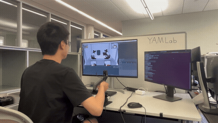</p>

- ♾️ **MimicGen** — turn a few demos into unlimited and automatically-generated training data.

  <p align="center">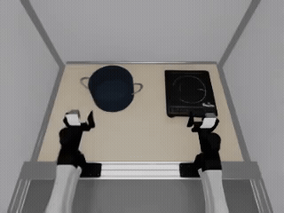 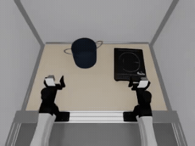 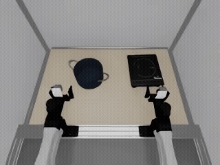</p>

- 🎨 **Domain randomization** — material textures + HDRI lighting for sim-to-real transfer.

  <p align="center">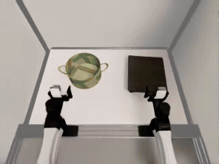 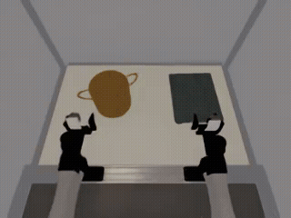 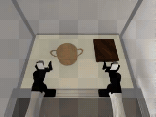</p>

- ⚡ **Large-scale evaluation** — massively parallel rollouts: **~1,389 env-steps/s across 128 environments on a single NVIDIA RTX 5090**, with a throughput benchmark you can drop your own policy into.

  <p align="center">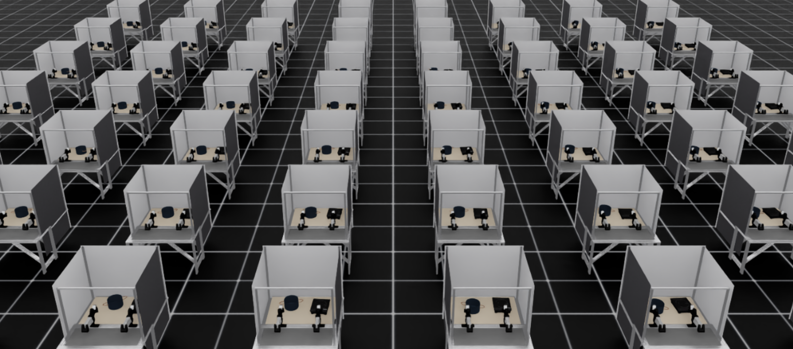<br><em>Large-scale parallel evaluation — hundreds of YAM workstations stepping at once.</em></p>

## Contents

- [1. Installation](#1-installation)
- [2. Data & Downloads](#2-data--downloads)
- [3. Asset Organization](#3-asset-organization)
- [4. Pipeline & Usage](#4-pipeline--usage)
- [5. Tasks](#5-tasks)
  - [5.1 PutPotOnCooktop](#51-putpotoncooktop)
  - [5.2 HangMugOnTree](#52-hangmugontree)
- [6. How-To Guide](#6-how-to-guide)
  - [6.1 Changing Parameters](#61-changing-parameters)
    - [6.1.1 Overview](#611-overview)
    - [6.1.2 Common Parameters](#612-common-parameters)
      - [6.1.2.1 Simulation rate and episode length](#6121-simulation-rate-and-episode-length)
      - [6.1.2.2 Parallel envs and device](#6122-parallel-envs-and-device)
      - [6.1.2.3 Camera pose and intrinsics](#6123-camera-pose-and-intrinsics)
      - [6.1.2.4 Add a camera](#6124-add-a-camera)
      - [6.1.2.5 Rename a saved dataset key](#6125-rename-a-saved-dataset-key)
      - [6.1.2.6 Which arm grasps which object](#6126-which-arm-grasps-which-object)
      - [6.1.2.7 Object spawn randomization](#6127-object-spawn-randomization)
      - [6.1.2.8 Render and recorded resolution](#6128-render-and-recorded-resolution)
      - [6.1.2.9 Recorded-frame trimming](#6129-recorded-frame-trimming)
      - [6.1.2.10 Controller gains and grasp thresholds](#61210-controller-gains-and-grasp-thresholds)
      - [6.1.2.11 Domain randomization](#61211-domain-randomization)
  - [6.2 Defining a New Task](#62-defining-a-new-task)
  - [6.3 Adding a New Embodiment (Robot)](#63-adding-a-new-embodiment-robot)
  - [6.4 Common Questions](#64-common-questions)
- [7. Repository Structure](#7-repository-structure)
- [8. Acknowledgments](#8-acknowledgments)

## 1. Installation
This creates the `yam_lab` conda environment with the full simulation pipeline
(this package, LeRobot, Isaac Sim 5.1.0 + IsaacLab, JoyLo, and runtime deps).
Choose **one** of the two methods below.

### 1.1 Option A — One Script (Recommended)
Clone this repository, `cd` into it, then run:

```bash
bash install.sh                 # creates the "yam_lab" env; use -e NAME for a different name
conda activate yam_lab
```

`install.sh` runs all the steps from Option B in order and answers the IsaacLab
installer's confirmation prompt automatically (no interaction needed). It pins
IsaacLab to a tested commit (`ISAACLAB_COMMIT` in the script). The `cmake` /
`build-essential` step uses `sudo` and may ask for your password.

### 1.2 Option B — Step by Step
1. Set up the environment (run from the repository root):
    ```bash
    mkdir deps
    conda create -n yam_lab python=3.11 -y && conda activate yam_lab
    pip install --upgrade pip
    pip install torch==2.7.0 torchvision==0.22.0 --index-url https://download.pytorch.org/whl/cu128
    pip install -e .
    ```

2. Install [LeRobot](https://github.com/huggingface/lerobot):
    ```bash
    cd deps
    git clone git@github.com:RogerDAI1217/lerobot.git
    cd lerobot
    git checkout lerobotv2.0
    conda install -y -c conda-forge ffmpeg x264
    pip install -e .
    cd ../..
    ```

3. Install [IsaacLab](https://isaac-sim.github.io/IsaacLab/main/source/setup/installation/pip_installation.html)
   (pinned to a tested commit):
    ```bash
    pip install "isaacsim[all,extscache]==5.1.0" --extra-index-url https://pypi.nvidia.com
    sudo apt install cmake build-essential
    cd deps
    git clone git@github.com:isaac-sim/IsaacLab.git
    cd IsaacLab
    git checkout f4aa17f87e2e5db5484f0b5974918573e8918ce2
    # "none" skips the RL training frameworks (rl_games/rsl_rl/sb3/skrl) and robomimic
    ./isaaclab.sh --install none      # answer "Yes" when prompted
    cd ../..
    ```

4. Install JoyLo (the teleoperator package):
    ```bash
    cd joylo
    pip install -e .
    cd ..
    ```

5. Install other dependencies:
    ```bash
    conda install -c conda-forge "libgcc-ng>=12.3" "libstdcxx-ng>=12.3" -y
    pip install coacd pymeshlab usd-core open3d portal
    ```

## 2. Data & Downloads
Everything the pipeline needs is published as a single Hugging Face dataset —
**[`yamlab/yamlab_datasets`](https://huggingface.co/datasets/yamlab/yamlab_datasets)**. Download
all of it, or pull only the pieces for the stage you want to start from.

```
yamlab/yamlab_datasets/
├── HDRIs/indoor/{train,eval}/              # DR lighting maps (shared across tasks)
├── materials/{train,eval}/<category>/      # DR materials (shared across tasks)
└── tasks_data/<Task>/                      # one bundle per task (PutPotOnCooktop, HangMugOnTree)
    ├── objects/                             # USD object instances
    ├── teleop/                              # raw teleoperation demos (HDF5)
    ├── annotated/                           # MimicGen-annotated demos (HDF5)
    ├── lerobot_mimic/                       # generated LeRobot v2.0 dataset
    └── lerobot_mimic_domain_randomization/  # generated LeRobot v2.0 dataset (DR variant)
```

| Path | What it is | Used by |
|------|-----------|---------|
| `HDRIs/indoor/{train,eval}` | environment lighting maps | `--hdris_path` (replay / generate / evaluate) |
| `materials/{train,eval}` | MDL materials + textures | `--materials_path` |
| `tasks_data/<task>/objects` | USD object instances | `--asset` / `--assets_root_path` — every stage |
| `tasks_data/<task>/teleop` | raw human demos (HDF5) | `--dataset_file` (replay / annotate) — *skip teleoperation* |
| `tasks_data/<task>/annotated` | annotated demos (HDF5) | `--input_file` (generate) — *skip annotation* |
| `tasks_data/<task>/lerobot_mimic[_domain_randomization]` | generated `LeRobotDataset` | policy training — *skip generation* |

**Download** with the helper script (resolves the repo paths for each selection):

```bash
python scripts/download_data.py --all                                  # the whole dataset
python scripts/download_data.py --domain_randomization                 # HDRIs + materials only
python scripts/download_data.py --task PutPotOnCooktop                  # one task, all parts
python scripts/download_data.py --task PutPotOnCooktop --parts lerobot  # just the training data
python scripts/download_data.py --task PutPotOnCooktop --task HangMugOnTree --parts teleop,annotated,objects  # two tasks: demos + assets
```

`--parts` takes any comma-separated subset of `objects`, `teleop`, `annotated`, `lerobot`, and
`lerobot_dr` (the domain-randomized LeRobot variant); omit it to get all of the task's parts.

…or with the Hugging Face CLI directly (folders are selected with `--include` globs):

```bash
hf download yamlab/yamlab_datasets --repo-type=dataset --local-dir ./yamlab_datasets \
    --include "tasks_data/PutPotOnCooktop/lerobot_mimic/**"
```

### 2.1 Domain Randomization
For sim-to-real transfer, replay, MimicGen generation, and evaluation can randomize the
scene's **materials** (object/table/robot textures) and **lighting** (HDRI environment maps).
This is enabled per run with `--enable_domain_randomization` and requires at least one of
`--materials_path` or `--hdris_path` — so **download the DR materials and/or HDRIs above** if
you want to use it. Without the flag, the pipeline runs with the default appearance and no
download is required.

**Materials** (`--materials_path`) — MDL materials split into `train/` and `eval/`; within each
split, materials are grouped by category, each `.mdl` beside its texture folder. Pass the
matching split: `train` for data generation, `eval` for held-out evaluation. Fetch them with
`python scripts/download_data.py --materials`.

```
materials/
├── train/   (Wood/Ash.mdl + Ash/ textures, Metals/, Plastics/, Carpet/, …)  ← --materials_path for generation
└── eval/    (held-out materials, same categories)                           ← --materials_path for evaluation
```

**HDRIs** (`--hdris_path`) — environment lighting, split into `train/` and `eval/`. Pass the
matching split: `train` for data generation, `eval` for held-out evaluation.

```
HDRIs/indoor/
├── train/   (abandoned_bakery-4k.hdr, …)   ← --hdris_path for generation
└── eval/    (billiard_hall-4k.hdr, …)      ← --hdris_path for evaluation
```

> **Bring your own — domain randomization is general-purpose.** The bundled materials and HDRIs
> are only a starting set. Drop in **any** `.hdr` environment maps (e.g. more from
> [Poly Haven](https://polyhaven.com/hdris)) or **any** MDL materials + textures and they are
> picked up automatically, as long as they follow the directory layout above — HDRIs under
> `train/` and `eval/`, and each material as a `.mdl` beside its texture folder under a category
> directory.

## 3. Asset Organization
Object assets are organized under a single **assets root directory**:

```
assets_root_path/
├── category_1/                    ← asset category
│   ├── instance_1/                ← asset instance (.usd, asset_size.json, collision meshes)
│   ├── instance_2/
│   └── …
├── category_2/
│   └── …
└── …
```

- **assets_root_path** — top-level directory of all categories; passed as `--assets_root_path`
  to replay, annotation, and generation scripts.
- **Asset category** — a subdirectory grouping related instances.
- **Asset instance** — a leaf directory with the actual asset files (`.usd`, `asset_size.json`, …).

During teleoperation, objects are supplied per-object via the repeatable `--asset NAME=PATH`
flag (e.g. `--asset pot=/abs/path/category/instance`). The last two path components
(`category/instance`) are stored in the recorded HDF5; downstream scripts (replay, annotation,
MimicGen) reconstruct full paths by joining `--assets_root_path` with the stored
`category/instance`. This keeps datasets portable across machines — only `--assets_root_path`
changes — and lets objects in one scene come from different categories.

### 3.1 Preprocessing: `asset_size.json`
**Every asset instance needs an `asset_size.json`** next to its `.usd`. It holds the object's
world-space bounding-box size (`{"size": {"x", "y", "z"}}`), which the pipeline uses to rest
the object on the table at the right height and to size its randomization region. **The assets from the
[download links](#2-data--downloads) above already include it**, so you only need to run this
for your own USDs:

```bash
# one asset instance
python scripts/precompute_asset_sizes.py --usd /path/to/category/instance/instance.usd

# or a whole category (one subfolder per instance)
python scripts/precompute_asset_sizes.py --dir /path/to/category
```

## 4. Pipeline & Usage
Collect data one of two ways, then train and evaluate your own policy:

- **State replay:** teleoperation → **replay** (re-render observations from recorded states).
- **MimicGen:** teleoperation → **annotate** → **generate** (generate many demos from a few).

Domain randomization (`--enable_domain_randomization` with `--hdris_path` / `--materials_path`)
applies to the **replay**, **generate**, and **evaluate** stages only — teleoperation and
annotation run without it. Pass `--help` on any script for its full options.

### 4.1 Teleoperation — Collect Demos
Collect human demonstrations by driving the sim arms with the JoyLo leader. This needs the
JoyLo hardware (Dynamixel leader arms + JoyCon) and a one-time motor calibration.

➡️ **See [`joylo/README.md`](joylo/README.md)** for the calibration step and the
follower/leader teleoperation commands.

> **No JoyLo hardware?** Download the **Teleop demos (HDF5)** from
> [Data & Downloads](#2-data--downloads) and start at Replay (4.2) or Annotate (4.3).

### 4.2 Replay — Render Observations from Recorded States
Re-simulates recorded teleoperation states and saves the requested observation modalities to a
LeRobot dataset (optionally with domain randomization).

```bash
python scripts/replay_data.py \
    --task PutPotOnCooktop-v0 \
    --dataset_file /path/to/teleoperation_data.hdf5 \
    --assets_root_path /path/to/assets \
    --output_root /path/to/replay_dataset \
    --observation_modalities "rgb,proprioception" \
    --camera_width 320 --camera_height 240 --image_downsample_factor 1 \
    --task_description "Put the pot on the induction cooktop" \
    --enable_gripper_clamp \
    --enable_cameras \
    --headless
```

`--enable_gripper_clamp` clamps the gripper command once a grasp is detected, preventing the
fingers from over-closing on (and crushing or ejecting) the grasped object.

**Inputs:** raw teleop trajectories as `--dataset_file` (the **Teleop demos (HDF5)**) and the
**Object assets** as `--assets_root_path` — both from [Data & Downloads](#2-data--downloads).
**Output:** a LeRobot dataset of re-rendered observations under `--output_root`.

### 4.3 Annotate — Mark Subtask Boundaries for MimicGen
Replays demos and auto-detects (`--auto`) the subtask termination signals MimicGen needs,
writing an annotated HDF5.

```bash
python scripts/mimic/annotate_demos.py \
    --task PutPotOnCooktop-Mimic-v0 \
    --input_file /path/to/teleoperation_data.hdf5 \
    --output_file /path/to/annotated_dataset.hdf5 \
    --assets_root_path /path/to/assets \
    --auto \
    --enable_cameras \
    --headless
```

**Inputs:** the **Teleop demos (HDF5)** as `--input_file` + the **Object assets**.
**Output:** an annotated HDF5 — sanity-check yours against the downloadable
**Annotated demos (HDF5)**, which mark the same subtask boundaries.

### 4.4 Generate — Data Generation with MimicGen
Randomizes object poses and stitches subtask segments to generate many new trajectories,
saving full observations directly to a LeRobot dataset. Built on
[Isaac Lab Mimic](https://isaac-sim.github.io/IsaacLab/main/source/overview/environments.html#imitation-learning),
IsaacLab's integration of [MimicGen](https://arxiv.org/abs/2310.17596).

```bash
python scripts/mimic/generate_dataset.py \
    --task PutPotOnCooktop-Mimic-v0 \
    --input_file /path/to/annotated_dataset.hdf5 \
    --output_root /path/to/generated_dataset \
    --generation_num_trials 100 \
    --num_envs 10 \
    --assets_root_path /path/to/assets \
    --observation_modalities "rgb,proprioception" \
    --camera_width 320 --camera_height 240 --image_downsample_factor 1 \
    --task_description "Put the pot on the induction cooktop" \
    --enable_gripper_clamp \
    --enable_domain_randomization \
    --hdris_path /path/to/HDRIs/indoor/train \
    --materials_path /path/to/materials \
    --enable_cameras \
    --headless
```

**Inputs:** the **Annotated demos (HDF5)** as `--input_file` + the **Object assets** (plus
**DR materials** / **HDRIs** if randomizing). **Output:** a LeRobot dataset under `--output_root`
— compare yours against the downloadable **Generated dataset (LeRobot)** to confirm your setup.

### 4.5 Evaluate — Throughput Benchmark
Creates the full evaluation-mode environment and steps it with a swappable action source,
printing startup and per-step throughput statistics. It ships with a model-free action sweep
so it runs with no checkpoint; replace `compute_actions` in the script with your own policy to
turn it into a real evaluation loop.

```bash
python scripts/benchmark_eval_throughput.py \
    --task PutPotOnCooktop-v0 \
    --asset pot=/path/to/pot \
    --asset cooktop=/path/to/cooktop \
    --num_envs 128 \
    --observation_modalities "rgb,proprioception" \
    --camera_width 320 --camera_height 240 --image_downsample_factor 1 \
    --enable_cameras \
    --headless
```

**Inputs:** the **Object assets** via repeatable `--asset NAME=PATH`. Plug a trained policy into
`compute_actions` (14-D action; see [6.3](#63-adding-a-new-embodiment-robot) for the layout);
with no policy it runs the built-in joint sweep, so the command above works out of the box for a
throughput check.

**Throughput.** On a **single NVIDIA RTX 5090**, 128 parallel environments at 320×240
rendering sustain **~1,389 env-steps/s** (≈10.9 steps/s per env, ~46× the 30 Hz control rate),
with a tiny ~0.4 GB GPU-memory footprint — fast enough to make large-scale evaluation
practical on one consumer GPU.

```
============================================================
 YAM Eval Throughput Benchmark
============================================================
 Task            : PutPotOnCooktop-v0
 Device          : cuda        Num envs: 128
 Obs modalities  : rgb, proprioception
 Domain rand     : off
 Render          : 320x240 -> downsample 1 -> 320x240
 Action source   : builtin joint sweep (edit compute_actions() to plug a policy)
 Window          : 100 timed steps (+10 warmup)
------------------------------------------------------------
 Startup (one-time)
   App launch ............    5.11 s
   Python imports ........    1.87 s
   Env creation + scene ..   14.51 s
   First reset ...........    1.66 s
   Total .................   23.14 s
------------------------------------------------------------
 Per-step runtime           mean   median    p95     min     max   (ms)
   env.step() ...........   92.15   92.41   96.59   84.29   98.57
   obs extraction (gather)   0.32   (isolated; subset of env.step)
   action compute .......    0.06   (builtin sweep; your policy goes here)
------------------------------------------------------------
 Throughput
   Target control rate ...   30.00 Hz  (dt 0.03333 s)
   Achieved per-env ......   10.85 steps/s
   Effective .............  1389.0 env-steps/s  (x128 envs)
   Realtime factor .......    0.36x
   Peak GPU memory .......    0.42 GB allocated / 0.46 GB reserved
============================================================
```

## 5. Tasks
The repo ships two bimanual manipulation tasks. Each is a **staged** task whose stages are decided
by **success checks** — and those checks, together with the **MimicGen subtask boundaries** used
for data generation, lean heavily on **grasp detection** (see below). Every task
is defined in three places: `configs/tasks/<task>.yaml` (objects, spawn randomization, the
`grasp_detect` map, stage thresholds under `success:`, and `mimic_signals:`),
`envs/tasks/<task>_manager(_cfg).py` (scene, rewards, terminations, and the stage success logic),
and `envs/mimic/<task>_mimic_env(_cfg).py` (the MimicGen subtask definitions).

**Grasp detection.** The per-arm *"is this object grasped?"* signal (`self.robot.is_grasping()`)
underpins both the stage checks below and the MimicGen subtask-boundary signals. Per finger it
combines a **contact-force** check (force on the target object ≥ a threshold) with a **contact-pad**
check (the contact lies on the finger pad, not the fingertip); a gripper grasps when both of its
fingers pass. Which arm watches which object is the per-task `grasp_detect` map
([6.1.2.6](#6126-which-arm-grasps-which-object)); the force/pad thresholds are robot properties in
`configs/robot/yam.yaml` under `grasp:`.

### 5.1 PutPotOnCooktop
The bimanual YAM robot picks up the pot with both arms/hands and places it on the cooktop. Success
is **2-staged**:
- **Pick** — the pot is lifted >5 cm above its resting height while both grippers grasp it.
- **Place** — the pot is on the cooktop: its center within an XY tolerance of the cooktop, at the
  expected resting height, upright (within an orientation tolerance), and both grippers released.

Each stage must hold for a number of consecutive control steps before that stage is marked complete.

### 5.2 HangMugOnTree
The bimanual YAM robot picks the mug with its left arm, hands it over from the left arm to the right
arm, and hangs the mug on the mug tree. Success is **3-staged**:
- **Pick** — the left arm grasps the mug and lifts it >5 cm above its resting height.
- **Handover** — the right arm grasps the mug while it stays elevated, and the left arm releases.
- **Hang** — the mug is on the tree: its center within an XY tolerance of the tree, elevated above
  its resting height, and both grippers released.

Stages are gated in order (each is only checked once the previous one is complete), and each must hold
for a number of consecutive steps.

## 6. How-To Guide
### 6.1 Changing Parameters
#### 6.1.1 Overview
Tunable settings live in **layered YAML** under `yamlab/configs/`, resolved per
`(task, mode)`:

- `configs/defaults.yaml` — global defaults + per-mode settings (device, number of parallel
  envs, sim rate, rendering resolution, domain randomization).
- `configs/tasks/<task>.yaml` — per-task overrides (object randomization, success thresholds,
  friction, MimicGen signals, runtime kwargs, teleop pose schedule, which arm grasps which object).
- `configs/robot/yam.yaml` — robot/hardware calibration (camera intrinsics & poses, arm poses,
  finger geometry, controller gains, grasp thresholds); edit only to recalibrate.

Set a value at the **most specific layer** that should change — precedence is
`defaults < per-mode < task < CLI flag`.

📖 **Full reference** — precedence/variant rules, every config section and key, and worked
layer-by-layer examples — is in **[`yamlab/configs/README.md`](yamlab/configs/README.md)**.

#### 6.1.2 Common Parameters
The edits users make most often:

##### 6.1.2.1 Simulation rate and episode length

`configs/defaults.yaml` (or per task):

```yaml
sim:
  dt: 0.00833333          # 1/120 s → 120 Hz physics; control_hz = (1/dt) / decimation
  decimation: 4           # → 30 Hz control
  episode_length_s: 180.0 # time-out termination length (s)
```

##### 6.1.2.2 Parallel envs and device

Per mode in `defaults.yaml`, or override per run with `--num_envs`:

```yaml
modes:
  evaluation: {sim: {device: cuda, num_envs: 64}}   # teleop/replay → cpu,1 · mimicgen → cpu,4
```

##### 6.1.2.3 Camera pose and intrinsics

`configs/robot/yam.yaml` under `cameras:`:

```yaml
cameras:
  top:
    position: [0.086, -0.009, 1.704]                  # offset from the prim's parent (m)
    quaternion_opengl: [0.683, 0.183, -0.183, -0.683] # wxyz, OpenGL convention
    intrinsics: {fx: 392.2, fy: 391.7, cx: 318.4, cy: 237.9}
```

##### 6.1.2.4 Add a camera

Add one entry under `cameras:`; the scene, observations, and dataset features follow
automatically (recorded as `observation.images.<lerobot_key>`):

```yaml
cameras:
  front:
    prim_path: "{ENV_REGEX_NS}/FrontCamera"   # world-fixed; mount under an arm link for wrist-mounted
    position: [0.40, 0.0, 1.30]
    quaternion_opengl: [0.5, 0.5, -0.5, -0.5]
    intrinsics: {fx: 390.0, fy: 390.0, cx: 320.0, cy: 240.0}
    lerobot_key: front_rgb
```

##### 6.1.2.5 Rename a saved dataset key

Change a camera's `lerobot_key` in `configs/robot/yam.yaml`; recorded frames are stored under
`observation.images.<lerobot_key>`:

```yaml
cameras:
  top:
    lerobot_key: head_rgb   # frames now saved as observation.images.head_rgb
```

##### 6.1.2.6 Which arm grasps which object

`configs/tasks/<task>.yaml`; only the listed arms get finger contact sensors (thresholds come
from `robot/yam.yaml` `grasp:`):

```yaml
grasp_detect:
  left_arm: [pot]
  right_arm: [pot]
```

##### 6.1.2.7 Object spawn randomization

`configs/tasks/<task>.yaml` under `objects:`:

```yaml
objects:
  pot:
    mass: 0.5
    randomization:
      region_size: [0.15, 0.10]     # XY spawn box (m) — OR position_range (±), not both
      orientation_range_deg: 45.0   # ± yaw
      scale_range: [0.95, 1.05]     # uniform scale jitter
```

##### 6.1.2.8 Render and recorded resolution

`rendering:` in YAML, or per run on the CLI (recorded resolution = render resolution /
`image_downsample_factor`):

```bash
--camera_width 320 --camera_height 240 --image_downsample_factor 1
```

##### 6.1.2.9 Recorded-frame trimming

Drop settling or trailing frames from the saved dataset (`configs/defaults.yaml`, or per mode):

```yaml
recording: {discard_first_n_frames: 5, discard_last_n_frames: 0}
```

##### 6.1.2.10 Controller gains and grasp thresholds

`configs/robot/yam.yaml` (`controller.default: high_pd|base`, `grasp.normal_force_thresh`, …).
These are robot properties, not per-task knobs.

##### 6.1.2.11 Domain randomization

Turn on per run with `--enable_domain_randomization` (+ `--materials_path` / `--hdris_path`); tune
the ranges under `domain_randomization:` in `defaults.yaml`.

### 6.2 Defining a New Task
A task is more than a config file: it is a config + a task environment (a config/env pair) + an
optional MimicGen environment, all registered with gymnasium. The cleanest path is to copy the
existing `put_pot_on_cooktop` files and adapt them. For a task called `MyTask`:

1. **Config** — `configs/tasks/my_task.yaml`: declare `env_names: [MyTask-v0, MyTask-Mimic-v0]`,
   the `objects:` block (mass + randomization), the `grasp_detect` map (which arm grasps which
   object), and any `kwargs` / `success` / `friction` / `mimic_signals` / `pose_schedule`. See
   the [config README](yamlab/configs/README.md). A `pose_schedule` (teleop-only) is
   especially useful for collecting MimicGen source demos — it steps objects through a fixed
   grid of spawn poses for systematic coverage.

2. **Task environment** — in `yamlab/envs/tasks/` (template: `put_pot_on_cooktop_manager*.py`):
   - `my_task_manager_cfg.py` — a scene cfg subclassing `YamBimanualSceneCfg` that adds
     your object asset cfgs (`RigidObjectCfg` / `ArticulationCfg`), plus `Events` (object reset),
     `Rewards`, and `Terminations` cfgs, and a `MyTaskManagerEnvCfg(YamBimanualEnvCfg)` tying them
     together. Set `MyTaskManagerEnvCfg.CONTACT_OBJECT_NAMES = [...]` for grasp detection.
   - `my_task_manager.py` — `MyTaskManager(YamBimanualEnv)` implementing the task logic and
     the two required abstract methods `get_current_task_info()` and `reset_success_check()`; a
     `make_my_task_env(**kwargs)` factory that returns
     `make_task_env(MyTaskManagerEnvCfg, MyTaskManager, **kwargs)`; and
     `gym.register(id="MyTask-v0", entry_point="yamlab.envs.tasks.my_task_manager:make_my_task_env")`.
   - Reuse the success-check helpers in `yamlab/utils/task_logic.py` (pick / place-on-top /
     hang / below-table), or add new ones.

3. **MimicGen environment** *(optional — only if you want to auto-generate data)* — in
   `yamlab/envs/mimic/` (template: `put_pot_on_cooktop_mimic_env*.py`):
   - `my_task_mimic_env_cfg.py` — `MyTaskMimicEnvCfg(MyTaskManagerEnvCfg, MimicEnvCfg)` defining
     `subtask_configs` per arm: a list of `SubTaskConfig` entries, each naming the object a
     subtask is relative to, the termination signal that ends it, time offsets, and interpolation
     steps.
   - `my_task_mimic_env.py` — `MyTaskMimicEnv(MyTaskManager, YamMimicEnv)` implementing
     `get_subtask_term_signals()` (one sequentially-gated boolean tensor per subtask
     boundary); a `make_my_task_mimic_env` factory; and `gym.register(id="MyTask-Mimic-v0", ...)`.

4. **Register the modules** — add the new modules to `yamlab/envs/tasks/__init__.py` (and
   `yamlab/envs/mimic/__init__.py` if you added a MimicGen env) so their `gym.register` calls
   run on import.

5. **Assets** — provide asset instances (each with an `asset_size.json`) for the new objects and
   pass them with `--asset NAME=PATH` (see [Asset organization](#3-asset-organization)).

Once registered, the new task flows through the same data-collection (replay or MimicGen),
training, and evaluation pipeline as the built-in tasks.

### 6.3 Adding a New Embodiment (Robot)
The robot model is split so that almost nothing is YAM-specific: most of a new robot is data, and
you write code only for what genuinely differs. Mirror the [`robot/yam/`](yamlab/robot/yam)
package and read [`yamlab/robot/README.md`](yamlab/robot/README.md) for the full detail.

1. **Robot YAML** — `configs/robot/<name>.yaml`, same layout as
   [`yam.yaml`](yamlab/configs/robot/yam.yaml): arm base poses, gripper open/closed positions,
   camera poses & intrinsics, finger geometry, controller (PD) gains, grasp thresholds. The generic
   [`RobotSpec`](yamlab/robot/spec.py) loads it via `get_robot("<name>")` — no code.
2. **Robot package** — `yamlab/robot/<name>/`, mirroring [`robot/yam/`](yamlab/robot/yam): the
   IsaacLab `ArticulationCfg`(s) that load the robot's USD with its joint drives and gains; an
   **action layout** mapping each slot of the action vector to a joint (cf.
   [`YamActionLayout`](yamlab/robot/yam/action.py)); and a `<Name>Robot` class — for a two-arm
   parallel-jaw robot this is just [`BimanualRobot`](yamlab/robot/bimanual_robot.py) bound to the
   spec (cf. [`YamRobot`](yamlab/robot/yam/yam.py)). A different gripper or a dexterous hand is
   added here too; the robot README explains how.
3. **Robot base environment** — `yamlab/envs/<name>_env.py`, mirroring
   [`YamBimanualEnv`](yamlab/envs/tasks/yam_bimanual_env.py) and its cfg. This is the key piece:
   it builds the **scene** (the robot's arms + cameras), declares the **action terms** (one
   `JointPositionActionCfg` per arm and gripper, matching the action layout) and the
   **observations** (joint/gripper proprioception), and constructs
   `self.robot = <Name>Robot(self.scene, ...)`. Each task then subclasses this base env, exactly as
   the YAM tasks subclass `YamBimanualEnv`.
4. **Map tasks to the robot** — register each task's gym ID → robot name in
   [`yamlab/envs/robot_registry.py`](yamlab/envs/robot_registry.py).

Recalibrating the existing YAM (camera poses, gains, table or finger geometry, …) is just editing
[`configs/robot/yam.yaml`](yamlab/configs/robot/yam.yaml) — no code change.

### 6.4 Common Questions
- **Can I watch the sim instead of running headless?** Drop `--headless` to open the Isaac Sim
  viewer (needs a display); keep `--enable_cameras` if you also need camera observations.
- **How many environments / which device does each mode use?** Defaults live under `modes:` in
  `defaults.yaml` — teleop/replay `cpu×1`, MimicGen `cpu×4`, evaluation `cuda×64`. Override per
  run with `--num_envs`, or per task in its YAML. (Teleop/replay/MimicGen are CPU-bound by small
  per-env solves; evaluation uses the GPU for parallel-rollout throughput.)
- **How do I evaluate my own policy?** Replace `compute_actions()` in
  [`scripts/benchmark_eval_throughput.py`](scripts/benchmark_eval_throughput.py). Actions are the
  14-D vector `[left_arm(6), left_gripper(1), right_arm(6), right_gripper(1)]` defined in
  [`robot/yam/action.py`](yamlab/robot/yam/action.py).
- **What format are recorded datasets?** LeRobot v2 (parquet + MP4) written to `--output_root`;
  camera frames are keyed `observation.images.<lerobot_key>` from `yam.yaml` `cameras:`.
- **How do I use my own object meshes?** Convert to USD, run
  [`scripts/precompute_asset_sizes.py`](scripts/precompute_asset_sizes.py) to write each
  `asset_size.json`, then pass `--asset NAME=PATH` (see [Asset Organization](#3-asset-organization)).
- **My config edit is ignored or errors on load.** Unknown keys / wrong types are rejected by the
  schema ([`configs/schema.py`](yamlab/configs/schema.py)) — fix the key, or set it at the right
  layer (see the [config README](yamlab/configs/README.md)). A brand-new *global* knob must be
  added to `schema.py` first.
- **Does teleoperation need hardware?** Yes — Dynamixel leader arms + a JoyCon (see
  [`joylo/README.md`](joylo/README.md)). To skip it, start from the downloadable demos in
  [Data & Downloads](#2-data--downloads).

## 7. Repository Structure
```
yamlab/
├── yamlab/                          core simulation package (YAM environment, robot model, configs)
│   ├── robot/                         robot model — a generic, spec-driven core plus the YAM binding
│   │   ├── spec.py                    RobotSpec: IsaacLab-free view of a robot (links, joints, calibration)
│   │   ├── robot.py                   generic Robot · Arm · EndEffector · Gripper · Finger (grasp detection)
│   │   ├── bimanual_robot.py          BimanualRobot: pairs a left + right Arm into one robot
│   │   └── yam/                       YAM-specific binding
│   │       ├── yam.py                 YamRobot + YAM_CONFIG/_DEFAULT ArticulationCfgs (loads yam.usd)
│   │       ├── action.py              YamActionLayout: the 14-D action vector (arm + gripper indices)
│   │       └── arm/ workstation/ …    USD assets + calibration
│   ├── envs/
│   │   ├── manipulation_env_cfg.py    ManipulationEnvCfg — generic, robot-agnostic base config
│   │   ├── manipulation_env.py        ManipulationEnv — generic base env (randomization, recording, schedule)
│   │   ├── yam_bimanual_scene.py      YamBimanualSceneCfg — scene (2 arms, cameras, workstation)
│   │   ├── robot_registry.py          task → robot mapping (robot_for_task)
│   │   ├── tasks/
│   │   │   ├── yam_bimanual_env_cfg.py / yam_bimanual_env.py   YAM base env (scene, actions, robot)
│   │   │   └── <task>_manager(_cfg).py                          per-task env (PutPotOnCooktop, HangMugOnTree, …)
│   │   └── mimic/                     MimicGen subtask definitions (<task>_mimic_env(_cfg).py)
│   ├── configs/
│   │   ├── defaults.yaml              shared sim / rendering / recording / randomization defaults
│   │   ├── tasks/<task>.yaml          per-task overrides (objects, poses, grasp_detect, friction)
│   │   ├── robot/yam.yaml             YAM calibration: arm + camera poses, controller gains, grasp thresholds
│   │   ├── schema.py                  pydantic schema validating the merged config
│   │   └── loader.py                  merges defaults + task YAML into a validated config
│   ├── domain_randomization/          material + lighting randomization
│   ├── teleoperation/                 sim-side teleoperation RPC follower (driven by JoyLo)
│   └── utils/
│       ├── task_creation.py           create_task_environment() — the single env entry point (gym.make)
│       ├── grasp.py                   teleop grasp-ray overlay (GraspRayVisualizer)
│       ├── perception.py              observation extraction (masks, joint/gripper state) + calibration
│       ├── recorders.py               HDF5 streaming recorder + LeRobot v2 dataset writer
│       └── task_logic.py              task success checks + reward functions
├── joylo/                             JoyLo teleoperator — leader arms + JoyCon (drives the sim follower)
└── scripts/                           pipeline entry points:
    ├── precompute_asset_sizes.py      write each asset's asset_size.json (object placement)
    ├── replay_data.py               replay recorded demos with cameras + domain randomization
    ├── mimic/annotate_demos.py        mark subtask boundaries for MimicGen
    ├── mimic/generate_dataset.py      generate data with MimicGen → LeRobot dataset
    └── benchmark_eval_throughput.py   evaluation throughput benchmark
```

Key subpackages carry their own `README.md` with details — see `yamlab/robot/README.md` for the
robot model and `yamlab/configs/README.md` for the experiment configuration.

### 7.1 How the Pieces Fit
The whole stack is layered: a **config (YAML)** defines a **task environment**, and four **entry
points** (teleoperation, replay, MimicGen, evaluation) create and run it. The three figures below
open it up.

**Figure 1** — the environment owns a **Scene** (the robot arms, cameras, and task objects) plus
manager groups; **Events** handle resets and **object-pose randomization**, while a separate
**domain-randomization** subsystem varies materials and lighting. Because the environment is just a
config plus parts, most customization is a small, localized edit:

- **Tune the robot, cameras, or grasp** → [`configs/robot/yam.yaml`](yamlab/configs/robot/yam.yaml)
- **Add a task** → a [`configs/tasks/`](yamlab/configs/tasks) YAML + an [`envs/tasks/`](yamlab/envs/tasks) `*_manager(_cfg).py` pair
- **Add a robot** → a `configs/robot/<name>.yaml` + a [`robot/`](yamlab/robot)`<name>/` package

<p align="center">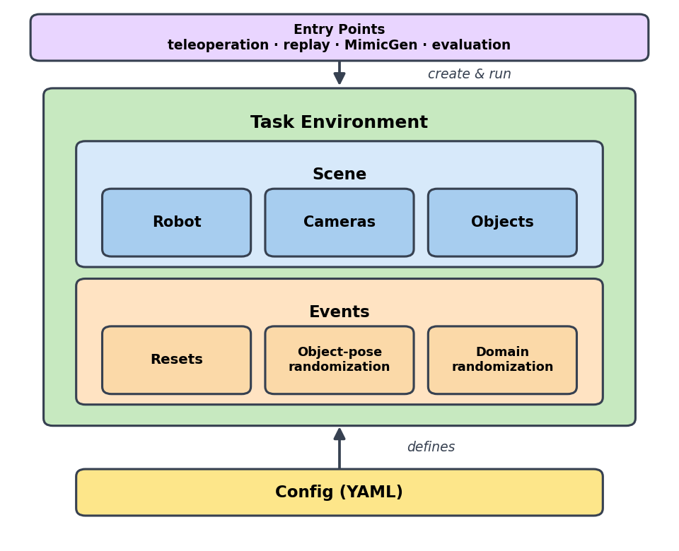</p>

**Figure 2** — the **robot model**. *Inheritance* derives the concrete robot
([`Robot`](yamlab/robot/robot.py) → [`BimanualRobot`](yamlab/robot/bimanual_robot.py) →
[`YamRobot`](yamlab/robot/yam/yam.py)); *composition* (has-a) opens up `YamRobot` — two
[`Arm`](yamlab/robot/robot.py)s, each with a parallel-jaw `Gripper` of two `Finger`s. Geometry
comes from [`RobotSpec`](yamlab/robot/spec.py), and the base classes fix neither the arm count
nor the end-effector type. See [`yamlab/robot/README.md`](yamlab/robot/README.md).

<p align="center">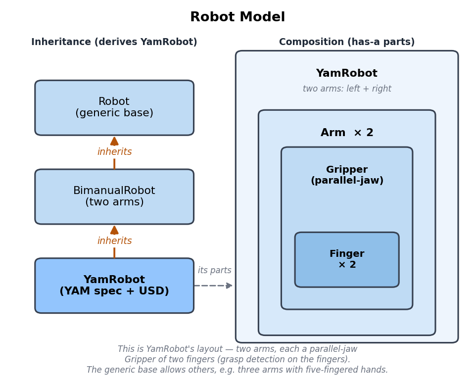</p>

**Figure 3** — the **environment** is a short inheritance chain:
[`ManagerBasedRLEnv`](https://isaac-sim.github.io/IsaacLab/main/index.html) (Isaac Lab) →
[`ManipulationEnv`](yamlab/envs/manipulation_env.py) (generic machinery) →
[`YamBimanualEnv`](yamlab/envs/tasks/yam_bimanual_env.py) (YAM scene, action, robot) →
[`PutPotOnCooktopEnv`](yamlab/envs/tasks/put_pot_on_cooktop_manager.py) (one task).

<p align="center">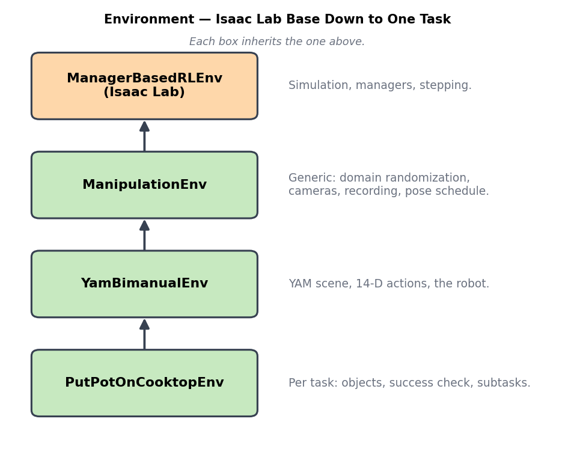</p>

## 8. Acknowledgments
This project builds on excellent open-source frameworks:

- **[NVIDIA Isaac Sim / Isaac Lab](https://github.com/isaac-sim/IsaacLab)** — the simulation,
  sensor, and managed-environment framework this stack is built on, including
  [**Isaac Lab Mimic**](https://isaac-sim.github.io/IsaacLab/main/source/overview/environments.html#imitation-learning),
  its MimicGen integration used for data generation.
- **[LeRobot](https://github.com/huggingface/lerobot)** — the dataset format (parquet + video)
  the recorder writes for training.
- **[Poly Haven](https://polyhaven.com/)** — HDRI environment maps for lighting randomization.

And on the following research:

- [**MimicGen**](https://arxiv.org/abs/2310.17596) and [**DexMimicGen**](https://arxiv.org/abs/2410.24185)
  — generating large simulation datasets from a handful of human demonstrations.
- [**VIRAL**](https://arxiv.org/abs/2511.15200) and [**DoorMan**](https://arxiv.org/abs/2512.01061)
  — domain randomization for sim-to-real transfer.
- [**Behavior Robot Suite**](https://arxiv.org/abs/2503.05652) — the **JoyLo** teleoperator used
  to collect demonstrations.
- [**GELLO**](https://arxiv.org/abs/2309.13037) — the low-cost leader-arm teleoperation design
  behind the JoyLo agent.
