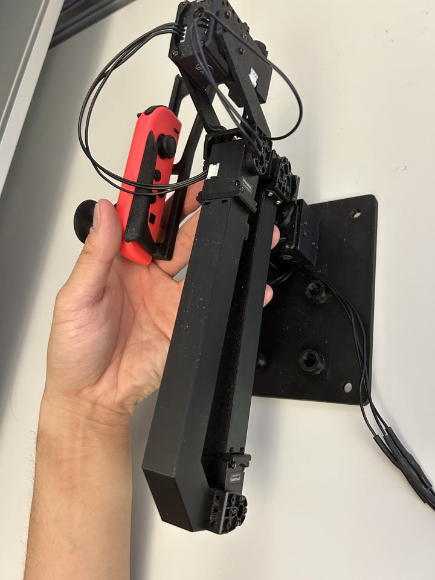
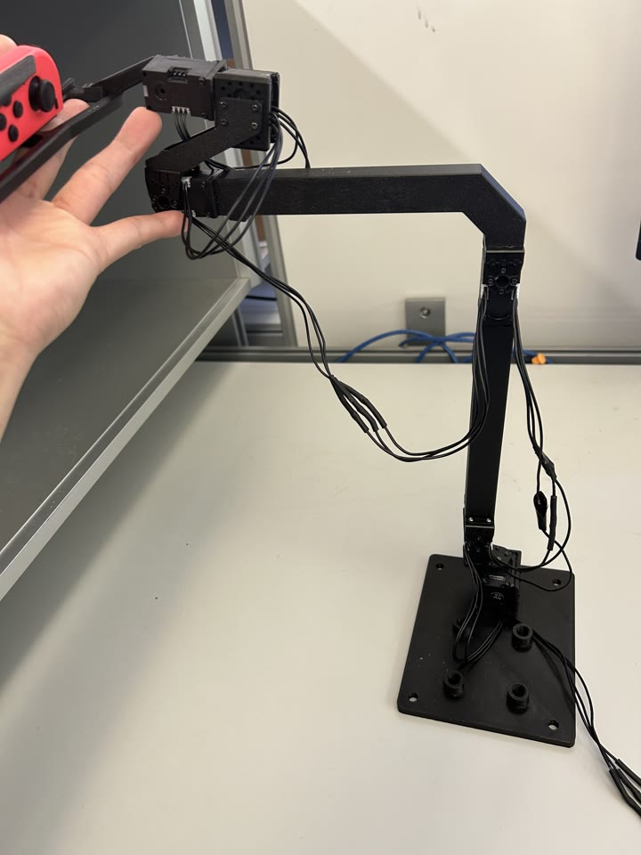
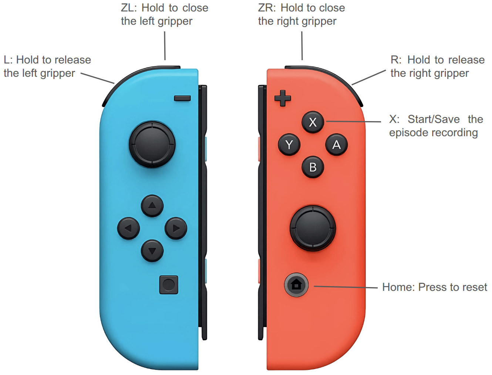

# JoyLo Teleoperation for YAM Bimanual Setup

JoyLo is a teleoperation system for controlling YAM bimanual arms in IsaacLab simulation using Nintendo JoyCon controllers and Dynamixel motors. This implementation is modified from [BEHAVIOR-1K JoyLo](https://behavior.stanford.edu/behavior_components/joylo.html) and adapted for YAM bimanual robot control.

## Hardware Setup

### 1. JoyLo Assembly

JoyLo uses passive GELLO-style leader arms. Assemble each arm by following the **Yam Passive** section of the [GELLO assembly guide](https://docs.google.com/document/d/1bdvqPiW4jI5PJm6aIFizhcTuyVJZGEIgqbJe92IoyaM/edit?tab=t.0#heading=h.afxeyqlq5k6g), with one change: replace the GELLO gripper link with the JoyLo gripper link.

Print all the 3D-printable STL models for the YAM leader arm links in [`yam_passive_gello_small/`](yam_passive_gello_small).

### 2. JoyCon Configuration & Connection

Configure and pair the Nintendo JoyCon controllers:

1. [Nintendo JoyCon Configuration](https://github.com/StanfordVL/BEHAVIOR-1K/tree/main/joylo#2-nintendo-joycon-configuration) — set up the udev rules so Linux recognizes the JoyCons.
2. [Connecting JoyCons](https://github.com/StanfordVL/BEHAVIOR-1K/tree/main/joylo#3-connecting-joycons) — pair the JoyCons over Bluetooth.

## Usage

Teleoperation runs in three steps: calibrate the JoyLo hardware once, launch the simulation
follower, then launch the JoyLo leader. Run everything in the `yam_lab` environment.

### 1. Calibrate JoyLo Hardware

**Required before first use.** Calibrates the joint signs and offsets for the YAM bimanual
JoyLo. Follow the prompts to place the arms in the two reference positions shown below.

<p align="center"> </p>

```bash
# From the repository root:
python joylo/scripts/calibrate_joints_yam.py \
    --gello_name yam_gello \
    --port /dev/ttyUSB0
```

### 2. Launch Follower (Simulation)

Starts the IsaacLab simulation and serves the two arms over an RPC server. Pass each object's
asset instance dir with `--asset`.

```bash
cd joylo/scripts
python launch_follower.py \
    --task PutPotOnCooktop-v0 \
    --asset pot=/abs/path/pot \
    --asset cooktop=/abs/path/cooktop \
    --port 11333 \
    --demos_per_asset 5 \
    --data_output_dir /path/to/datasets \
    --data_output_filename teleoperation_data \
    --enable_cameras
```

> **Pose schedule (for MimicGen source demos).** Add `--enable_pose_schedule` to step the
> object(s) through a fixed sequence of spawn poses (defined per task under
> `modes.teleoperation.pose_schedule` in `configs/tasks/<task>.yaml`), advancing one pose each
> time you save a trajectory. This gives systematic, evenly-spread coverage of object
> configurations — ideal for collecting MimicGen **source** demonstrations. The released source
> demos for the built-in tasks were collected this way.

### 3. Launch JoyLo Teleoperation

Reads the Dynamixel leader arms + JoyCon buttons and drives the follower via RPC. Run in a
second terminal while the follower is up.

```bash
cd joylo/scripts
python launch_joylo.py \
    --joylo_port /dev/ttyUSB0 \
    --joint_config ../configs/joint_config_yam_gello.yaml \
    --port 11333 \
    --enable_recording
```

## JoyCon Button Controls



| Button | Function |
|--------|----------|
| **ZL** (Left JoyCon, hold) | Close left gripper continuously |
| **ZR** (Right JoyCon, hold) | Close right gripper continuously |
| **L** (Left JoyCon, hold) | Open left gripper continuously |
| **R** (Right JoyCon, hold) | Open right gripper continuously |
| **X** (Right JoyCon) | Start/Save recording (1st press: start, 2nd press: save) |
| **HOME** (Right JoyCon) | Reset task and discard current trajectory |
| **Other buttons** | Print notification (no functionality yet) |

**Note**: All buttons have cooldown protection to prevent accidental multiple triggers.

## Data Collection Workflow

1. **Launch Follower**: Start IsaacLab simulation server (`launch_follower.py`)
2. **Launch JoyLo**: Start JoyLo teleoperation (`launch_joylo.py`)
3. **Initial Sync**: Simulation automatically syncs to current JoyLo position
4. **Position Arms**: Move JoyLo freely to position arms for the task
5. **Start Recording**: Press **X** to start recording trajectory
6. **Perform Demo**: Move physical JoyLo arms to perform the demonstration
7. **Save Trajectory**: Press **X** again to save the trajectory
8. **Reset Task**: Press **HOME** to reset for next demonstration (discards unsaved trajectory)
9. **Repeat**: Continue until all demonstrations are collected

**Important Notes:**
- You can move JoyLo arms freely BEFORE pressing X (simulation follows but doesn't record)
- Recording only happens between the first and second X press
- HOME button discards any unsaved trajectory
- Physical hardware NEVER moves automatically - only you move it

## System Architecture

### Control Flow

1. **Joint Position Reading**: `YAMGelloAgent` reads 12 DOF joint positions from Dynamixel motors via `DynamixelDriver`
2. **Gripper Control**: `JoyConAgent` reads ZL/ZR (close) and L/R (open) button states for continuous hold-based gripper control
3. **Command Assembly**: `MultiControllerAgent` combines arm joints (12 DOF) + gripper states (2 DOF) into 14 DOF bimanual command
4. **RPC Communication**: `BimanualFollowerClient` sends single 14 DOF command to IsaacLab via `portal` RPC
5. **Simulation Update**: `PortalSimServer` receives command, splits into left/right arms, and updates `ManagerBasedRLEnv`

### Key Classes

- **`YAMGelloAgent`**: Reads Dynamixel motor positions, applies calibration (offsets/signs)
- **`JoyConAgent`**: Handles JoyCon button input and continuous hold-based gripper control
- **`MultiControllerAgent`**: Combines arm and gripper control into unified command
- **`BimanualFollowerClient`**: RPC client for single bimanual connection (14 DOF)
- **`JoyLoTeleopController`**: Main controller handling button presses and teleoperation loop

### Data Flow

```
JoyLo Hardware → YAMGelloAgent (12 DOF) + JoyConAgent (2 DOF) → 
MultiControllerAgent → BimanualFollowerClient → Portal RPC → 
PortalSimServer → BimanualRPCServer → IsaacLab ManagerBasedRLEnv
```

## Citation

This implementation is based on the BEHAVIOR Robot Suite (BRS) JoyLo system:

```bibtex
@inproceedings{jiang2025brs,
    title={{BEHAVIOR} Robot Suite: Streamlining Real-World Whole-Body Manipulation for Everyday Household Activities},
    author={Yunfan Jiang and Ruohan Zhang and Josiah Wong and Chen Wang and Yanjie Ze and Hang Yin and Cem Gokmen and Shuran Song and Jiajun Wu and Li Fei-Fei},
    booktitle={9th Annual Conference on Robot Learning},
    year={2025},
    url={https://openreview.net/forum?id=v2KevjWScT}
}
```

**Acknowledgments**: This work builds upon the [BEHAVIOR Robot Suite](https://behavior-robot-suite.github.io/) which first proposed JoyLo for whole-body teleoperation.